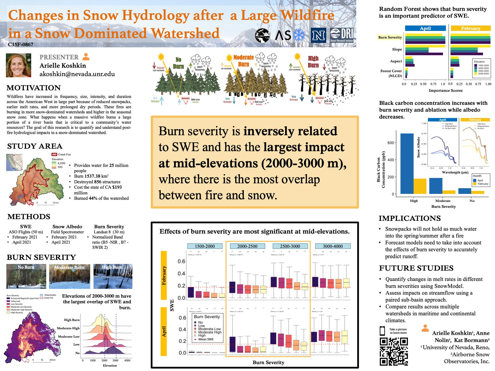

---
output:
  html_document:
    css: /Users/ariellekoshkin/Desktop/Grad_school/ariellekoshkin.github.io/air.css 
    vss: air.css
---

 
[Home](https://ariellekoshkin.github.io) | [CV](../cv/cv.html) | [Presentations](../presentations/pubs.html) | [Research](../research/research.html) | [AGU 2021](../AGU/dataviz.html)

# AGU Poster
<em>Click on the image to see the full visualization</em>
      
 

