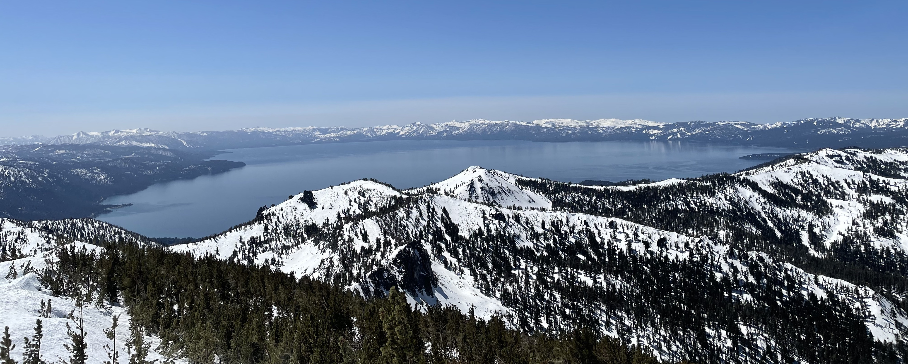
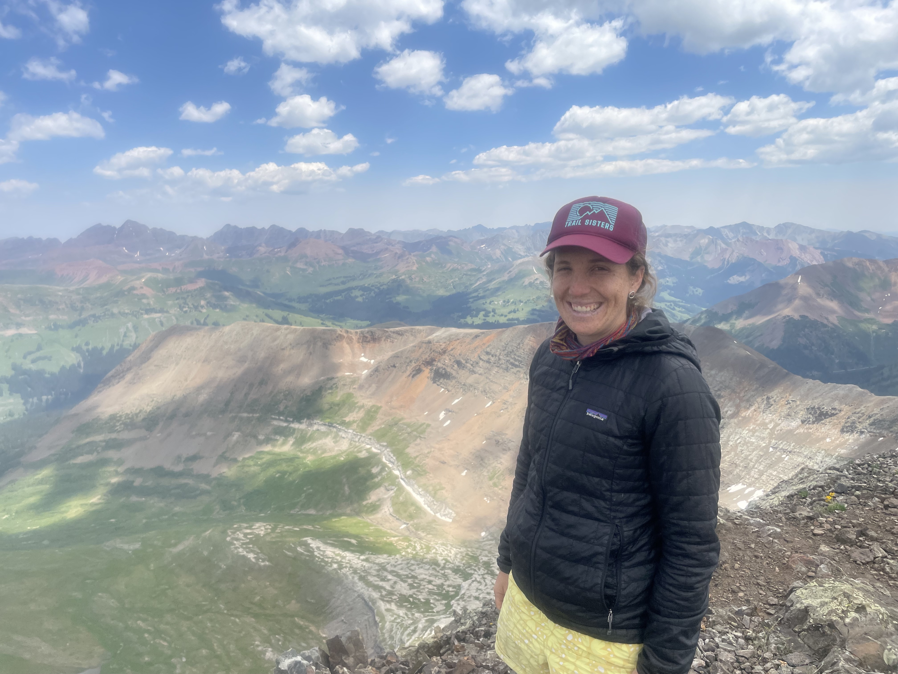

---
output:
  html_document:
    css: air.css
    vss: air.css
---

 
[Home](https://github.com/ariellekoshkin/ariellekoshkin.github.io.git) | CV | [Presentations](../presentations/pubs.html) | [Research](../research/research.html) | [AGU 2021](../AGU_2021/dataviz.html)

# Arielle Koshkin

</img> 

 
## MS Student, Hydrologic Sciences   University of Nevada, Reno

Arielle is a current master's student in the <a href="https://www.unr.edu/hydrologic-sciences">Graduate Program of Hydrological Sciences</a> at University of Nevada, Reno and part of the <a href="https://www.computationalmountainstudies.com/">  Computational Mountain Studies Research Group</a>. Her work explores how large fires impact the storage of snow and the downstream effects on water resources. Prior to graduate school, Arielle taught high school science, worked at a local land trust, and lead trips abroad for high school students. She grew up in Oakland, CA, and received a B.A. in Biology from Carleton College in Northfield, MN.
In her free time, she loves to explore the mountains by bike, foot, or ski.

 
 
</img> 

Contact me:  
Arielle Koshkin  
[akoshkin [at] nevada.unr.edu](mailto:akoshkin@nevada.unr.edu)

