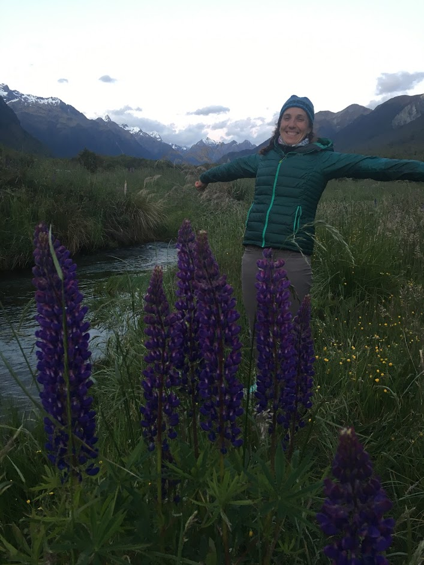

---
output:
  html_document:
    css: air.css
    vss: air.css
---

Home | [CV](cv/cv.html) | [Publications](publications/pubs.html) | [Research](research/research.html) | [DataViz](dataviz/dataviz.html)

# Arielle Koshkin
## MS Student, Hydrologic Sciences   University of Nevada, Reno

I am broadly interested in how large environmental disasters such as fire impact the storage of our snow and in turn our water resources. 

I am currently investigating the impacts of the California Creek Fire on the alpine and sub-alpine snowpack. I am curious how such a large fire can impact melt rates of snow and subsequently the water available from snowmelt to downstream users. Using a combination of remote sensing techniques, field-based measurements, and modeling, I seek to quantify the decline in water availability after the fire.

I grew up in Oakland, CA, and received a B.S. in Biology from Carleton College in Northfield, MN. Prior to graduate school, Arielle taught high school science, worked at a local land trust, and lead trips abroad for high school students. She is currently pursuing a Master's Degree in the Graduate Program of Hydrological Science. Her research is focused on understanding the post-fire impacts on alpine snowpack in snow-dominated watersheds and the subsequent hydrological impacts these massive fires have on water resources. In her free time, she loves to explore the mountains by bike, foot, or ski.

</img> 
</img> 

 

Contact me:  
Arielle Koshkin  
[akoshkin [at] nevada.unr.edu](mailto:akoshkin@nevada.unr.edu)

