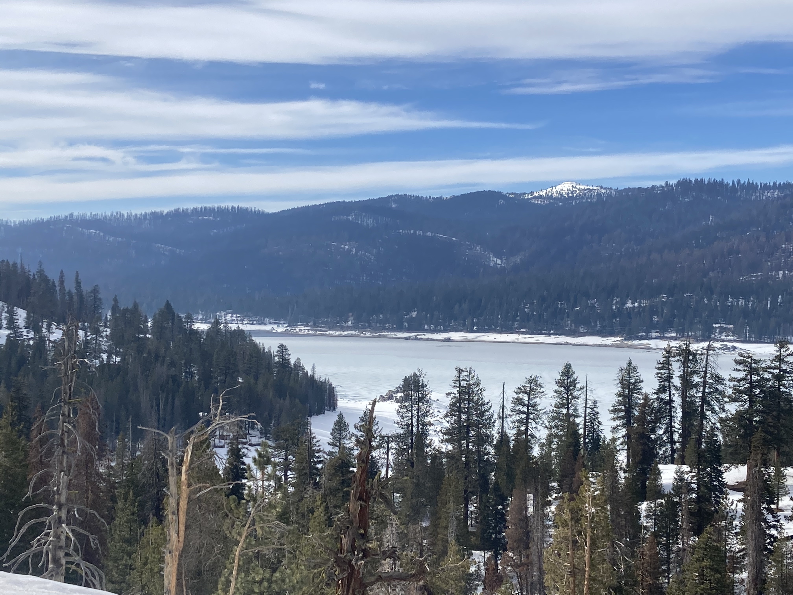

---
output:
  html_document:
    css: /Users/ariellekoshkin/Desktop/Grad_school/ariellekoshkin.github.io/air.css 
    vss: air.css
---

 
[Home](https://ariellekoshkin.github.io) | [CV](../cv/cv.html) | [Presentations](../presentations/pubs.html) | [Research](../research/research.html) | [AGU 2021](../AGU/dataviz.html)

# About my research

## The Creek Fire and San Joaquin Watershed

 I am currently investigating the impacts of the California Creek Fire on the alpine and sub-alpine snowpack. In the fall of 2020, the Creek Fire burned almost 40% of the Upper San Joaquin watershed (USJ), a large portion of which is in the seasonal snow zone. The USJ is an important watershed because it supplies water to the larger San Joaquin River that is a direct source of water for many farmers in the Central Valley of California, our nation’s hub of food production. Because of the USJ’s importance for water supply in California, the Airborne Snow Observatory Inc. (ASO) has flown light detection and ranging (LiDAR) and hyperspectral imagery multiple times each year since 2015 to monitor snow depth and snow water equivalent (SWE). I am curious how such a large fire can impact melt rates of snow and subsequently the water available from snowmelt to downstream users. Using a combination of remote sensing techniques, field-based measurements, and modeling, I seek to quantify the decline in water availability after the fire. Our field measurements were also used as validation for the ASO flight campaign.

 

</img> 

  

